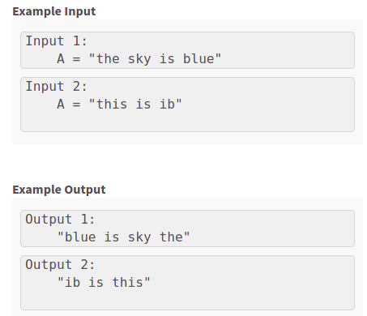

### Description for the program reverse_string_stacks
--------------------------------------------------------------------
#### Problem Description

Given a string A of size N.
Return the string A after reversing the string word by word using `Stacks`.

NOTE:
A sequence of non-space characters constitutes a word.
Your reversed string should not contain leading or trailing spaces, even if it is present in the input string.
If there are multiple spaces between words, reduce them to a single space in the reversed string.

- Here's the sample input/output for the program

---------------------------------------------------------------------------

### What is stack?

-A stack is a data structure that operates based on LIFO (Last In First Out) technique. The std::stack allows elements to be added and removed from one end only

#### Create a stack

To create a stack, we must include the <stack> header file in our code. We then use this syntax to define the std::stack:

`template <class Type, class Container = deque<Type> > class stack;`
- Type – is the Type of element contained in the std::stack. It can be any valid C++ type or even a user-defined type.
- Container – is the Type of underlying container object.

#### Operations in Stack

A C++ stack supports the following basic operations:

- push – It adds/pushes an item into the stack.   
    `stack.push(value)`
- pop – It removes/pops an item from the stack.
    `stack.pop(value)`
- peek – Returns the top item of the stack without removing it.

- isFull – Checks whether a stack is full.
- isEmpty – Checks whether a stack is empty.