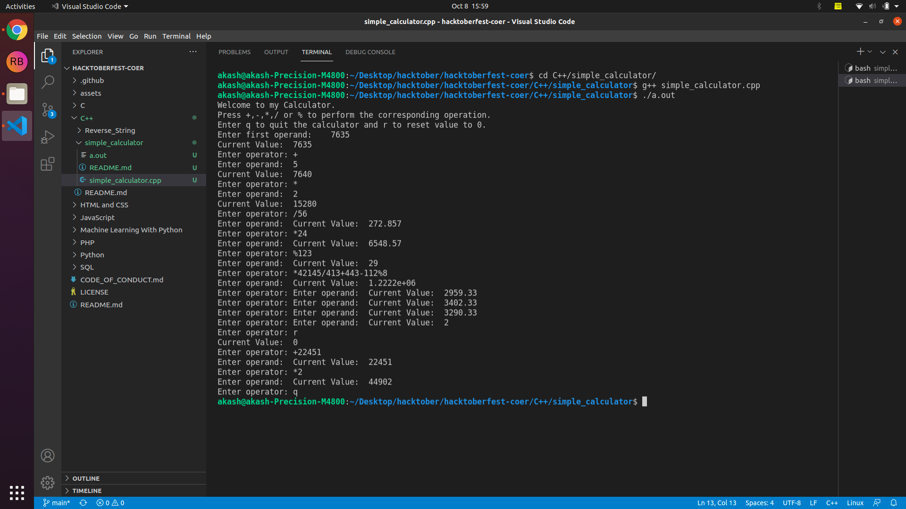

## Description for the program simple_calculator
--------------------------------------------------------------------
#### Problem Description

Create a simple calculator in C++

- The calculator should include 5 basic operations (i.e., Addition, Subtraction, Multiplication, Division, Modulus)
- The code should include comments
- There should be proper documentation (description, inputs, and outputs) contained in README.md file.
- The file should be in the proper directory (e.g., C++/name_of_the_file)
- The file names must be in snake case (i.e., ' ' replaced by '_')

- Here's the sample input/output for the program

---------------------------------------------------------------------------